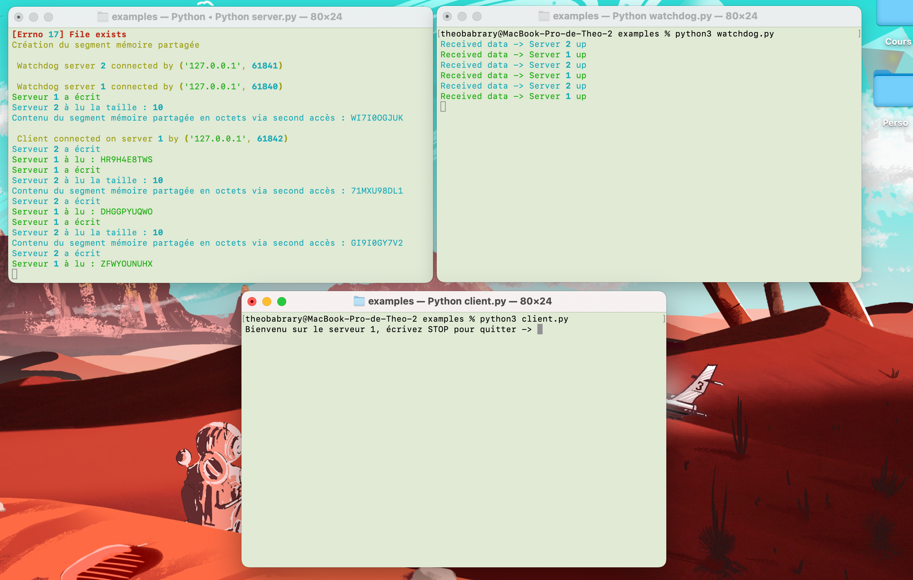

# FISA4 - OSPS


Projet OSPS Théo BARBARY ⚙️ et Martin THIBAUT 🦋

### Lancer le projet 

- Ouvrir 3 terminaux différents
- Lancer un fichier par terminal dans cet ordre :

```
python3 server.py
python3 watchdog.py
python3 client.py
```


